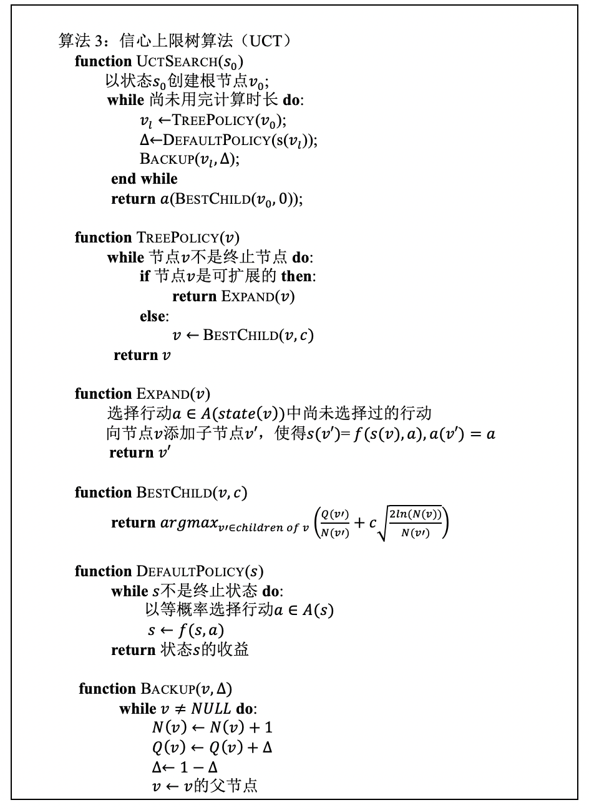
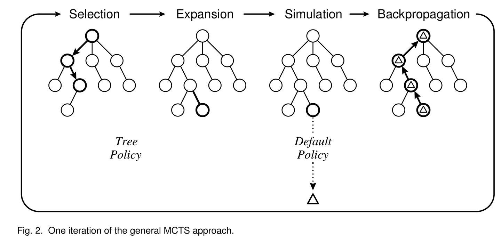
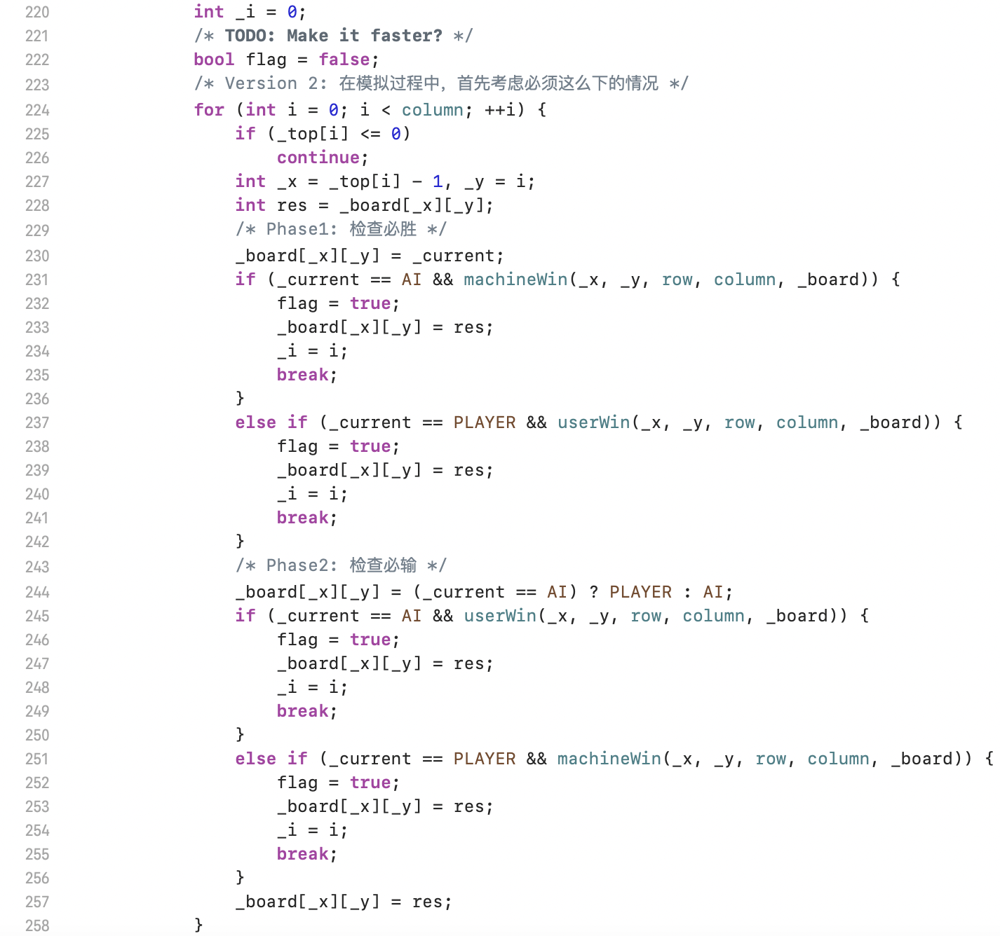
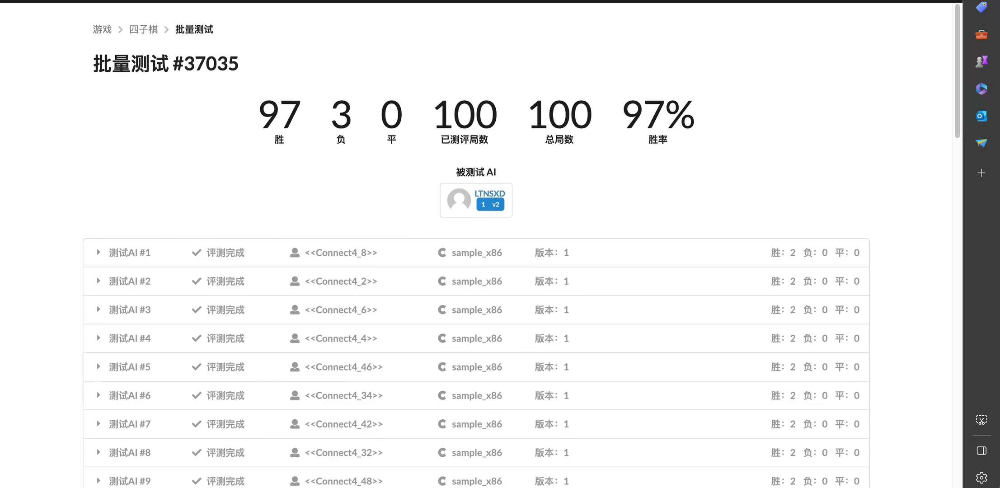
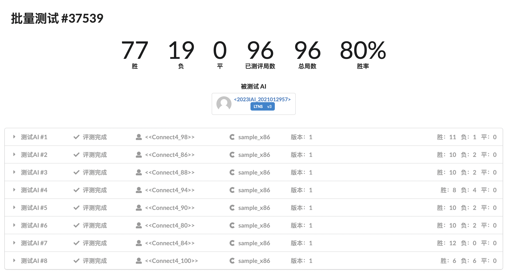

# ConnectFour实验报告

## 信心上限树算法（UCT）

> 本次实验最终采用了UCT作为AI的实现方式。

UCT算法是将UCB1算法应用到蒙特卡洛树搜索的结果。简单来说，信心上限树搜索的过程可以由下图的伪代码解释：

可以看到信心上限树的搜索过程实际可以概括为以下四个步骤

- 选择(对应`TreePolicy`): 对于某一个节点，在搜索树中选择该节点的**所有子节点中最急切需要被拓展的节点**(这个过程由`TreePolicy`和`BestChild`合作完成)。具体来说，这里所谓的**最急切**，体现在**可以拓展**和**信心值最大**这两个方面。

- 拓展(对应`Expand`): 对于某一可以拓展的节点，**随机**选取其某一个可以拓展的状态，并在搜索树中为该节点创造拓展状态对应的子节点。
- 模拟(对应`DefaultPolicy`): 对于刚才被拓展选中的节点，**随机**地落子，**直到下完一盘完整的棋局**(达到胜利、失败，或是平局)。

- 回溯(对应`Backup`): 对于刚才被拓展选中的节点，我们已经得到了随机下完的棋局的结果。现在将这个结果逐层地回传给它的父节点(直至根部)。

如此解释依然有些抽象，辅助下面的图和<ruby>重力四子棋<rt>ConnectFour</rt></ruby>的场景，我再进行具体的阐释：

- 选择：对于一个节点，其状态无非有以下三种：
  - 该节点所有可行动作都已经被拓展过。那么我们将使用UCB1算法选择他所有子节点中信心上限最高的那一个。
  - 该节点还有行动没有被拓展过。那么我们直接选择未被拓展的那一个。
  - 该节点是一个结束的棋局。那么它应当进行回溯。
- 拓展：一个节点可以拓展的所有状态，无非由其`top[]`数组决定。如果某一列的`top[i] > 0`那么这一列就是可以拓展的。而拓展过程就是在这些`top[i] > 0`的`i`中随机选择一个。

- 模拟：对于四子棋来说，我们直接让计算机“随意”地下，直到棋局结束。
- 回溯：设定输/赢/平局的权值，逐层向上更新。

最终，当计算时间耗尽时，我们利用`BestChild`选择一个最佳的节点，作为我们这一步的策略。

## 改进方向与思路

### 信心上限索引

在原始的UCT算法中，信心上限的组成为：
$$
I = \frac{Q(v^\prime)}{N(v^\prime)} + c\sqrt{\frac{2\ln(N(v))}{N(v^{\prime})}}
$$
这里$v^{\prime}$是$v$的子节点，$\frac{Q(v^\prime)}{N(v^\prime)}$是$v^\prime$的“胜率”。在<ruby>重力四子棋<rt>ConnectFour</rt></ruby>游戏中，考虑到除了胜/负以外，还有平局的可能性，这里将**胜率项**稍作修改。具体体现为：

- 胜利的棋局回溯值为1
- 失败的棋局回溯值为-1
- 平局回溯值为0

信心上限的组成不变，但$\frac{Q(v^\prime)}{N(v^\prime)}$不再体现胜率，而是一个与胜率有关的值。

### 功防策略

在人类下四子棋时，如果某一步我们已经有三个棋连在一起，或是对手已经有三个棋连在一起（并且最后一个棋的位置是马上就能下的），那么我们肯定会将棋下在那一位置，以立马获得胜利/组织对手立马获得胜利。

于是，在`Strategy.cpp`中，如果如上的情形真的发生了，那么算法将跳过搜索树这一步骤，直接进行必胜/阻止必败的棋的下。在程序中这里利用了框架提供的`machineWin`函数与`userWin`函数来进行方便的实现（细节可以参见`Strategy.cpp`）。

### 模拟策略

> 既然选择了UCT算法作为实现，我还是认为应当尽可能少地在`DefaultPolicy`中加入专家知识，这样才能体现算法的强大性。

#### 迅速攻防

如前，在最终决定落子位置时，我们首先需要考虑是否有必胜/对手必胜的可能性。在`DefaultPolicy`模拟棋局的过程中，也可以加入这一策略来使模拟更加的聪明，也更加的有**启发性**。

然而这也降低了模拟棋局时的速度，而且这种浪费可能是原先的**几倍**！所以在最终的实现中，舍弃了这一种优化。这将在下面的**思考**中展示。具体实现如下图所展示（并没有包含在提交的代码中）:

#### 权值更改

在与同学交流的过程中，我了解到可以在模拟的过程中尽可能地使计算机选择中间的位置来落子（以提高总的胜率）。于是在模拟过程中，我更改了棋盘每一列的权重，使得越靠近棋盘中间的列权值更高，在**随机**选择的过程中更容易被选中。具体来说，我将列的权重设置为:
$$
weight[] = \{1, 2, 3, ..., \frac{N}{2}, ..., 3, 2, 1\}
$$
于是，在模拟过程中随机选择的位置就更有可能落在中间而不是两侧。

#### c值选择

在信心上限的组成公式中，使得选择过程能够选到那些还没怎么被访问过的节点主要依赖于$c$的选择。我们可以这么理解：$c$越大代表程序越愿意探寻那些“未走过的路”，而$c$越小代表程序越愿意选择已有的胜率好的节点。

在这里，由于我们的信心上限索引与真正的“胜率”有出入，也即因为输掉的棋局反馈值为$-1$，导致胜率项的波动相较于第二项更大。因此，综合与其他同学的交流和我自己的实验，最终选取了$c = 0.7$作为最终参数。事实上我发现$c$在$[0.7, 1.0]$之间时带来的影响并不大，在对阵几个强劲的AI时，他们的胜率几乎是持平的。

## 实验结果

> 最终没有采取模拟过程中的迅速攻防策略。

在平台上测试时，胜率在$[0.94, 0.97]$之间波动。（评测机快时很可能达到$0.97$以上，而运气不好时可能只有$0.94$）

经过观察，我的AI经常（可能）打不过的AI有：

- `<<Connect4_100>>`
- `<<Connect4_94>>`
- `<<Connect4_86>>`
- `<<Connect4_84>>`
- `<<Connect4_98>>`
- `<<Connect4_88>>`
- `<<Connect4_80>>`
- `<<Connect4_90>>`

于是在对他们进行单独测试（在平台上，因为在本地算力支持的情况下，往往能稳赢这些AI=。=）。

得到的胜率结果如下:

| 对阵的AI | 胜率  |
| -------- | ----- |
| 100      | 50%   |
| 94       | 66.7% |
| 86       | 83.3% |
| 84       | 100%  |
| 98       | 91.7% |
| 88       | 83.3% |
| 80       | 83.3% |
| 90       | 83.3% |

可以看出，我的AI和`100.dylib`仅能打个平手，能勉强胜出`94.dylib`一些。对于其他几个强劲的对手，我的AI可能会以一个较小的概率输给他们。

然而我发现了一个非常神奇的特性，那便是单独将这几个AI拎出来单打，与总体测试时的胜率，是不一样的。。。唯一可能的解释就是在这两个状态下，评测机的性能有差异，导致了模拟次数的减少。所以在连续测试100局时，我的AI面对这些对手时的实际胜率应该更低一些。

## 一些思考

既然选择了UCT算法进行本次实验，那么考量规定时间内模拟的次数是很重要的。简单来说，更多的模拟往往能穷尽不同的情况，进而使得AI变得更加强大。于是如何改进程序内部的算法，使得模拟得**更快**，便变得尤为重要。

在计算过程中，我给予AI的模拟时间为$1.8s$，然后我将程序在**棋局之初**能够模拟的次数（在本地）打印出来。对比有快速攻防和没有快速攻防的版本:

| 版本                   | 模拟次数 |
| ---------------------- | -------- |
| 无快速攻防（最终版本） | ~300000  |
| 有快速攻防             | ~90000   |

可以看出，加上检查攻防以后，模拟次数基本上变成了原来的$\frac{1}{3}$。也难怪加上这一条策略对胜率没有什么改进：

**即使它导致了更好的启发性，但他对性能的影响太大了！**

另外，评测机的模拟次数与本地的模拟次数也有一些差异：

| 环境             | 模拟次数 |
| ---------------- | -------- |
| 本地（Apple M2） | ~300000  |
| 评测机           | ~150000  |

可以看出本地的性能也比评测机好不少，这也解释了为何本地基本上能够稳定打败`100.dylib`。

不过网站上一些奇怪的特性我还是无法解释，例如某一些对手就像时间吞噬者一样：当我把计算时间设置为$2s$以上时，我的AI就会直接超时，而且还是在第一步。我有些难以想象究竟是什么触发了这个问题，我不得不将计算时间缩短为$1.8s$。

## 心得体会

经过<ruby>重力四子棋<rt>ConnectFour</rt></ruby>的实验，我将马老师在课堂上所讲的蒙特卡洛搜索树以及其拓展真正地实现为了一段可执行的程序，并且这个过程也加深了我对蒙特卡洛搜索树的理解。我认为，在使用蒙特卡洛搜索算法时，有以下两个问题是值得思考的：

- 如何在有限的时间内尽可能多地模拟。
- 如何在有限的模拟次数内尽可能多地给予AI启发。

舍弃迅速攻防即是考虑了第一点，而让AI尽可能下中间则是考虑到了第二点。有了这样的原则以后，思考变得有方向了许多。

除此以外，经过不完全的思考以后，我认为$\alpha-\beta$剪枝算法的评价函数可能难以界定（这涉及到太多专家知识），所以最终我选择了蒙特卡洛搜索树的方法完成本次实验。如果有时间，或许我也可以好好思考如何使用$\alpha-\beta$剪枝来完成四子棋的AI设计。
